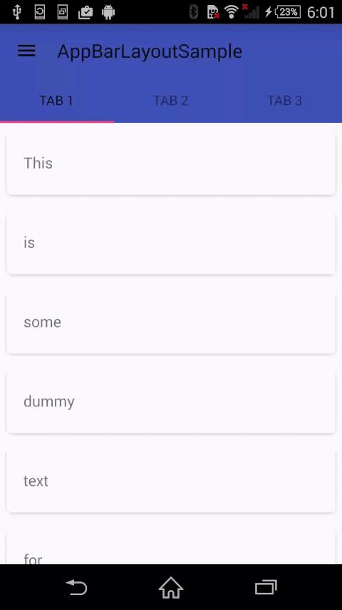

# AndroidDesignWidgetSample
A sample project for widgets in android.support.design.widget package.

Thanks to the repos:

[chrisbanes/cheesesquare](https://github.com/chrisbanes/cheesesquare)

[vitovalov/TabbedCoordinatorLayout](https://github.com/vitovalov/TabbedCoordinatorLayout)

This project is just a summary of their beautiful works.

### Widgets:
#### Widgets in MainActivity
* DrawerLayout + NavigationView
* CoordinatorLayout + AppBarLayout + Toolbar
* TabLayout + ViewPager
* CardView

#### Widgets in DetailsActivity
* CoordinatorLayout + AppBarLayout + Toolbar
* CollapsingToolbarLayout
* NestedScrollView
* CardView
* FloatingActionButton
* Snackbar

### Github repos:

[chrisbanes/cheesesquare](https://github.com/chrisbanes/cheesesquare)

[vitovalov/TabbedCoordinatorLayout](https://github.com/vitovalov/TabbedCoordinatorLayout)

### Android Reference:
[Android Support Design Widgets](http://developer.android.com/reference/android/support/design/widget/package-summary.html)  